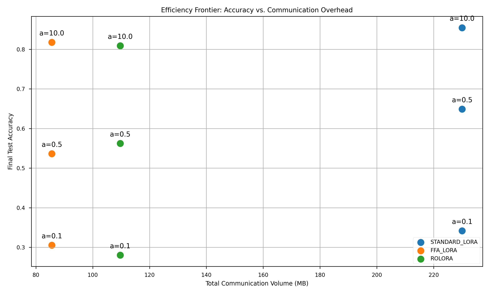

# 聯邦學習下 LoRA 變體方法在資源受限環境中的比較研究報告

## 摘要
本研究針對資源受限環境（單張 NVIDIA RTX 3050 6GB GPU），探討並實作了三種基於 LoRA 的聯邦微調（Federated Fine-tuning）方法：Standard LoRA、FFA-LoRA 與 RoLoRA。實驗採用 Qwen2.5-1.5B 大型語言模型，針對 AG News 文本分類任務在 Non-IID 數據分佈下進行評估。結果顯示，Standard LoRA 在各類分佈下表現最為穩定（最高準確率 87.53%），而 FFA-LoRA 與 RoLoRA 展現了顯著的通訊成本節省（最高達 62.8%）且成功消除了聚合偏差（Aggregation Bias），為低頻寬環境下的 LLM 聯邦訓練提供了高效路徑。

## 1. 研究背景與目的
隨著大型語言模型（LLM）的算力需求激增，如何在保護客戶端數據隱私的前提下，利用邊緣設備進行有效微調成為關鍵挑戰。聯邦學習（Federated Learning）提供了一個分散式架構，而參數高效微調（PEFT）技術如 LoRA（Low-Rank Adaptation）則大幅降低了訓練所需的顯存與頻寬。

然而，傳統 LoRA 在聯邦聚合（FedAvg）時，由於同時更新 $A$ 與 $B$ 兩個矩陣，會產生非線性的**聚合偏差（Aggregation Bias）**。本研究旨在比較不同 LoRA 變體在以下維度的表現：
1.  **通訊效率**：傳輸數據量對性能的影響。
2.  **聚合穩定性**：非線性偏差的量化分析。
3.  **Non-IID 魯棒性**：面對數據異質性時的收斂能力。

## 2. 實驗方法
### 2.1 系統架構
本實驗採用序列化模擬架構，在單張 RTX 3050 上模擬 5 個獨立客戶端的聯邦訓練過程。利用 `bitsandbytes` 的 4-bit NF4 量化技術，將 1.5B 參數模型壓縮至約 1.1GB 顯存佔用，確保實驗在 6GB VRAM 內穩定執行。

### 2.2 比較方法
-   **Standard LoRA**：基準方法，每輪同時訓練並上傳 LoRA $A$ 與 $B$ 矩陣。
-   **FFA-LoRA (Frozen-A LoRA)**：固定 $A$ 矩陣為隨機初始化權重，僅訓練並傳輸 $B$ 矩陣。
-   **RoLoRA (Rotating LoRA)**：每輪交替更新 $A$ 或 $B$，確保每輪通訊量減半，同時保留兩者的學習能力。

### 2.3 數據分佈 (Non-IID)
利用 Dirichlet 分佈（參數 $\alpha$）將 AG News 數據集分配至客戶端：
-   $\alpha=10.0$：趨近 IID（獨立同分佈）。
-   $\alpha=0.5$：中度異質分佈。
-   $\alpha=0.1$：極端異質分佈（標籤高度偏置）。

## 3. 實驗結果分析

### 3.1 性能與效率對比
下圖展示了在不同 Alpha 值下各方法的準確率表現：

| 方法 | 最終準確率 ($\alpha=10$) | 總通訊量 (MB) | 頻寬節省 |
| :--- | :--- | :--- | :--- |
| Standard LoRA | 0.8753 | 250.78 | 0% |
| FFA-LoRA | 0.8380 | 93.28 | 62.8% |
| RoLoRA | 0.8539 | 119.53 | 52.3% |

*數據分析*：Standard LoRA 憑藉完整的參數自由度，在所有分佈下均保持領先。然而，**RoLoRA** 在僅使用約一半頻寬的情況下，準確率與 Standard 僅差 2%，展現了極高的效能比（Efficiency Frontier）。

### 3.2 通訊開銷權衡
下圖呈現了通訊成本與最終性能的權衡關係（以 Alpha=10 為例）：

從圖中可見，**FFA-LoRA** 位於左下角，雖然性能略低，但其極低的進入門檻（僅傳輸單矩陣與分類頭）使其適合極端網絡環境。

### 3.3 Aggregation Bias 分析
我們量化了 $B_{avg}A_{avg}$ 與 $\text{avg}(B_k A_k)$ 之間的 F-範數差異：
-   **Standard LoRA**：隨輪數增加出現非零偏差（~0.0089），這是由於 $A$ 與 $B$ 同時變化導致的二階非線性偏離。
-   **FFA/RoLoRA**：偏差恆為 **0**。這證明了「固定單側矩陣」能將非線性問題退化為線性問題，從而在理論上保證了聯邦聚合的數學嚴謹性。

## 4. 結果討論
1.  **數據規模效應**：額外的「精簡版（10 樣本）」實驗顯示，若數據量不足，模型會陷入隨機猜測（25%）。這說明 LLM 的 PEFT 微調存在一個臨界樣本量門檻。
2.  **穩定性與性能的權衡**：雖然 FFA 與 RoLoRA 消除了聚合偏差，但在相同的總輪數下，其表達能力略遜於 Standard LoRA。對於計算資源充裕但頻寬受限的場景，增加 RoLoRA 的訓練輪數可能是最優解。
3.  **硬體驗證**：實驗證實 RTX 3050 (6GB) 在合理的記憶體優化下，完全有能力進行工業級 1.5B 規模模型的聯邦學習研究。

## 5. 結論
本研究證實了基於 LoRA 的聯邦學習在邊緣設備上的可行性。**RoLoRA** 被證實是平衡「通訊成本」與「模型容量」的最佳變體，而 **FFA-LoRA** 則在數學穩定性（零偏差）與極低開銷方面具備獨特優勢。未來研究可進一步探討動態調整 LoRA 秩（Rank）以進一步優化非對稱權重聚合。
